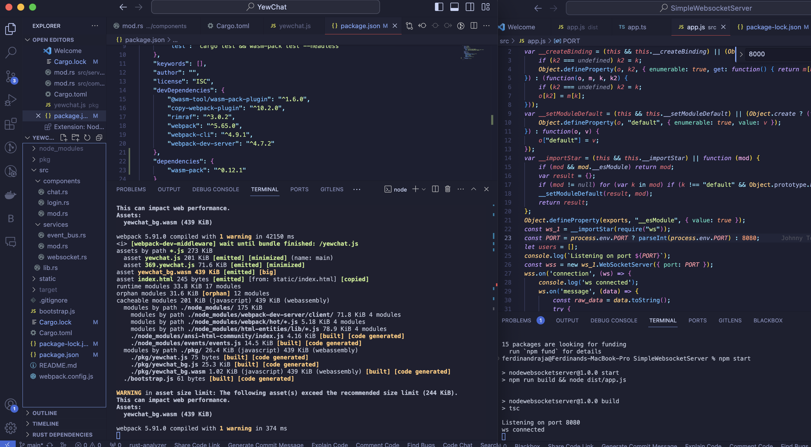
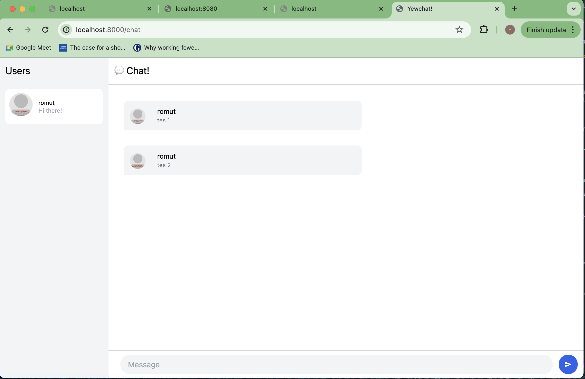
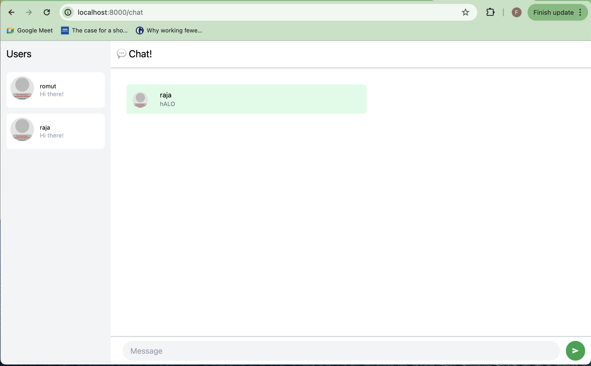

### Ferdinand Raja Kenedy - 2206046683
//-----------------------------------------------------------------------------
## Experiment 3.1: Original code
### Terminal Run

### Browser Run

## Experiment 3.2: Be Creative!

For the modification, I change the background color and send message color to green to match with what whatsapp did in the app.
